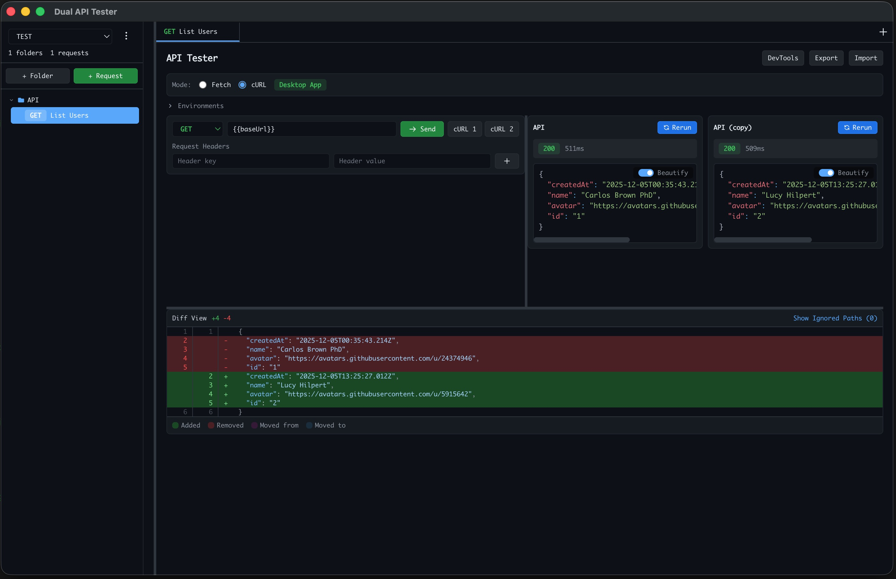

# Dual API Tester

A powerful desktop application for comparing API responses across different environments. Built with Electron, React, and TypeScript.
Available for mac, linux and windows


<p align="center">
  
</p>

## Features

### Environment Management
- **Multiple Environments** - Create unlimited environments with custom variables
- **Variable Substitution** - Use `{{variableName}}` syntax in URLs, headers, and request bodies
- **Single or Dual Mode** - Test against one environment or compare two side-by-side

### Request Builder
- **All HTTP Methods** - GET, POST, PUT, PATCH, DELETE
- **Syntax Highlighting** - JSON body editor with real-time highlighting
- **Custom Headers** - Add any headers with variable substitution support
- **Tabs** - Keep multiple requests open and switch between them

### Response Comparison
- **Side-by-Side View** - See responses from both environments simultaneously
- **Visual Diff** - GitHub-style diff with additions, removals, and moved lines
- **Ignored Paths** - Exclude dynamic fields (timestamps, IDs) from diff comparison
- **Response Details** - Status codes, timing, headers, and formatted JSON

### Organization
- **Folders** - Organize requests into nested folders
- **Save Requests** - Save and reuse your API requests
- **Persistent State** - All settings and requests saved to disk

### Developer Experience
- **cURL Export** - Generate cURL commands with a popup modal and copy button
- **Resizable Panels** - Customize the layout to your preference
- **Dark Theme** - Easy on the eyes for long debugging sessions
- **Cross-Platform** - Works on macOS, Linux, and Windows

## Installation

### Download Pre-built Binaries

Download the latest release for your platform from the [Releases](https://github.com/your-repo/releases) page:

| Platform | Architecture | Format |
|----------|--------------|--------|
| macOS | Apple Silicon (M1/M2/M3) | `.dmg`, `.zip` |
| macOS | Intel | `.dmg`, `.zip` |
| Linux | x64 | `.AppImage`, `.deb`, `.tar.gz` |
| Linux | ARM64 | `.AppImage`, `.deb`, `.tar.gz` |
| Windows | x64 | `.exe` (installer), `.exe` (portable) |

### Build from Source

Prerequisites:
- Node.js 18+
- npm

```bash
# Clone the repository
git clone https://github.com/danvaly/dualenv-apitest.git
cd dualenv-apitest

# Install dependencies
npm install

# Run in development mode
npm run electron:dev

# Build for your platform
npm run electron:build:mac      # macOS (both architectures)
npm run electron:build:linux    # Linux (x64 and ARM64)
npm run electron:build:win      # Windows
```

## Quick Start

### 1. Create an Environment

1. Expand the **Environments** section
2. Click **+ New Environment**
3. Add variables like:
   - `baseUrl` = `https://api.production.com`
   - `apiKey` = `your-api-key-here`

### 2. Build a Request

1. Select your HTTP method (GET, POST, etc.)
2. Enter your endpoint using variables: `{{baseUrl}}/api/users`
3. Add headers if needed: `Authorization: Bearer {{apiKey}}`
4. For POST/PUT/PATCH, add your JSON body

### 3. Send and Compare

- **Single Environment**: Select only one environment and click **Send**
- **Dual Environment**: Select both environments to compare responses

### 4. Analyze Results

- View responses side-by-side
- Check the diff view for differences
- Use **Ignored Paths** to exclude dynamic fields like `timestamp` or `requestId`

## Variable Substitution

Use double curly braces to reference environment variables anywhere in your request:

```
Endpoint:  {{baseUrl}}/api/users/{{userId}}
Header:    Authorization: Bearer {{token}}
Body:      {"environment": "{{envName}}"}
```

Variables are substituted when the request is sent, keeping your requests portable across environments.

## Keyboard Shortcuts

| Action | Shortcut |
|--------|----------|
| Send Request | `Cmd/Ctrl + Enter` |
| New Tab | Click `+` in tab bar |
| Close Tab | Click `×` on tab |

## Request Modes

### Fetch Mode (Default)
Uses the browser's native `fetch` API. May encounter CORS restrictions when testing external APIs.

### cURL Mode
Uses native cURL execution (in desktop app) or a proxy server (in browser). Bypasses CORS restrictions.

**Desktop App**: cURL runs natively with no additional setup.

**Browser**: Start the cURL proxy server:
```bash
node curl-server.cjs
```

## Project Structure

```
├── electron/           # Electron main process
│   ├── main.cjs       # Main process entry
│   └── preload.cjs    # Preload script (IPC bridge)
├── src/
│   ├── components/    # React components
│   │   ├── CurlModal.tsx
│   │   ├── EnvironmentManager.tsx
│   │   ├── RequestBuilder.tsx
│   │   ├── ResponseComparison.tsx
│   │   ├── ResizeHandle.tsx
│   │   ├── Sidebar.tsx
│   │   └── TabBar.tsx
│   ├── types.ts       # TypeScript interfaces
│   └── App.tsx        # Main application
├── build/             # App icons
└── release/           # Built binaries
```

## Configuration Storage

The app stores configuration in:

| Platform | Location |
|----------|----------|
| macOS | `~/Library/Application Support/dual-env-tester/config.json` |
| Linux | `~/.config/dual-env-tester/config.json` |
| Windows | `%APPDATA%\dual-env-tester\config.json` |

Use **Export** and **Import** buttons to backup or share your configuration.

## Technology Stack

- **Electron** - Desktop application framework
- **React 19** - UI framework
- **TypeScript** - Type safety
- **Vite** - Build tool
- **Tailwind CSS** - Styling
- **diff** - Response comparison

## Development

```bash
# Start development server with hot reload
npm run electron:dev

# Run web version only
npm run dev

# Type check
npm run build

# Lint
npm run lint
```

## Building

```bash
# Build for current platform
npm run electron:build

# Platform-specific builds
npm run electron:build:mac-arm     # macOS ARM64
npm run electron:build:mac-x64     # macOS Intel
npm run electron:build:mac         # macOS (both)
npm run electron:build:linux       # Linux (x64 + ARM64)
npm run electron:build:win         # Windows
```

## License

MIT

## Contributing

Contributions are welcome! Please feel free to submit issues and pull requests.
